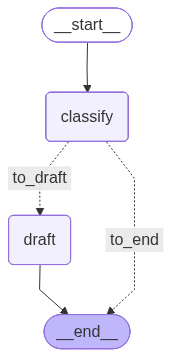

# Mailify Agent

A **100% local, privacy-first email triage agent**. It reads an unread email over
IMAP, classifies it with a self-hosted LLM, and — only for important mail — drafts
a reply and saves it back to your Drafts folder. No cloud APIs, no third-party
inference, no email content ever leaves your machine.

Built with [LangGraph](https://github.com/langchain-ai/langgraph) for the agent
pipeline and [Ollama](https://ollama.com) for local model inference.

> **Why local-only?** Email is sensitive. This project deliberately runs every
> inference step on-premise against open-source models. Swapping in a cloud LLM
> would be one line — the point is that you never have to.

---

## How it works

```text
                 ┌──────────────┐
   IMAP inbox ──▶│  fetch mail  │   pull oldest UNSEEN email
                 └──────┬───────┘
                        ▼
                 ┌──────────────┐
                 │  classify    │   local LLM → IMPORTANT | SUPPORT | NEWSLETTER | SPAM
                 └──────┬───────┘
              IMPORTANT │ else
                        ▼               ▼
                 ┌──────────────┐    (end)
                 │  draft reply │   local LLM writes a polite reply
                 └──────┬───────┘
                        ▼
                 IMAP Drafts folder
```

The graph is defined in [`agents/mail_graph.py`](agents/mail_graph.py). A conditional
edge routes only `IMPORTANT` mail to the drafting node; everything else terminates
early to save compute.

The compiled LangGraph, rendered straight from the code with `python render_graph.py`:



## Features

- **Fully offline inference** — models run through a local Ollama server (`localhost:11434`).
- **Agentic pipeline** — classify → route → draft, as an explicit LangGraph state machine.
- **Safe classification** — output is validated against a fixed category set; unknown responses fall back gracefully instead of trusting raw model text.
- **Human-in-the-loop by design** — the agent never sends mail. It writes a *draft* you review in your normal mail client.
- **Model-agnostic** — point it at any Ollama-served model via one env var.

## Requirements

- Python 3.10+
- A running [Ollama](https://ollama.com) instance with a pulled model, e.g. `ollama pull llama3`
- An IMAP mailbox (currently tuned for iCloud — see [Limitations](#limitations))

## Quickstart

```bash
# 1. Install deps
pip install -r requirements.txt

# 2. Start your local model
ollama pull llama3
ollama serve            # if not already running

# 3. Configure (environment variables)
export ICLOUD_EMAIL='your@icloud.com'
export ICLOUD_APP_PASSWORD='xxxx-xxxx-xxxx-xxxx'   # app-specific password, not your Apple ID password
export MODEL='llama3'

# 4. Run
python main.py
```

Each run processes **all currently unread emails**, oldest first. Fetching a mail
marks it as read, so a re-run won't reprocess it — drop this on a cron/systemd
timer to keep the inbox continuously triaged.

## Configuration

- **`ICLOUD_EMAIL`** — your iCloud email address.
- **`ICLOUD_APP_PASSWORD`** — an Apple app-specific password (see below), **not** your Apple ID password.
- **`MODEL`** — Ollama model tag to use (e.g. `llama3`, `mistral`).

### Getting an Apple app-specific password

iCloud blocks third-party apps from logging in with your normal Apple ID password.
You need a dedicated 16-character "app-specific password" instead:

1. Sign in at [account.apple.com](https://account.apple.com).
2. Go to **Sign-In and Security → App-Specific Passwords**.
3. Click **Generate an app-specific password** (or the **+**), give it a label
   like `mailify-agent`, and confirm with your Apple ID password.
4. Copy the generated password — it looks like `abcd-efgh-ijkl-mnop`.
5. Use it as `ICLOUD_APP_PASSWORD` (keep the dashes).

> Requires two-factor authentication to be enabled on your Apple ID. You can revoke
> the password anytime from the same screen without changing your main password.
> Full guide: [support.apple.com/102654](https://support.apple.com/en-us/102654).

## Using it yourself

1. **Install & start a local model** — [Ollama](https://ollama.com), then
   `ollama pull llama3` and make sure `ollama serve` is running on `localhost:11434`.
2. **Get your iCloud app-specific password** — see the section above.
3. **Set the three environment variables** (`ICLOUD_EMAIL`, `ICLOUD_APP_PASSWORD`,
   `MODEL`) as shown in [Quickstart](#quickstart).
4. **Run `python main.py`** — it triages every unread mail and writes reply drafts
   for the important ones straight into your iCloud Drafts folder.
5. **Review in your mail client** — the agent never sends anything. Open Apple Mail,
   check the drafts, edit if needed, and hit send yourself.

Using a different provider (Gmail, Outlook, self-hosted IMAP)? Point `imap_server`
in [`services/imap_service.py`](services/imap_service.py) at your provider's IMAP
host and adjust the Drafts folder name — the rest of the pipeline is unchanged.

## Project structure

```text
main.py                    entrypoint: fetch → run graph → upload draft
agents/mail_graph.py       LangGraph pipeline (state, nodes, routing)
services/imap_service.py   IMAP client: fetch unread, upload draft
requirements.txt
```

## Limitations

- **IMAP is tuned for iCloud** (server host + the `\Draft` flag quirk Apple requires).
  Generalizing to Gmail/Outlook/any IMAP host is mostly a config change in
  [`services/imap_service.py`](services/imap_service.py).
- Processes one email per invocation (intentional — keeps each run cheap and observable).
- Classification prompts and generated replies are in German; adjust the prompts in
  [`agents/mail_graph.py`](agents/mail_graph.py) for other languages.

## Roadmap

- [ ] Configurable IMAP provider (host + folder names) instead of hard-coded iCloud
- [ ] Batch processing with concurrency limits
- [ ] Structured logging + basic metrics (latency per node, tokens, category counts)
- [ ] Pluggable inference backend (Ollama today; vLLM / SGLang for higher throughput)

## License

Open source — MIT.
